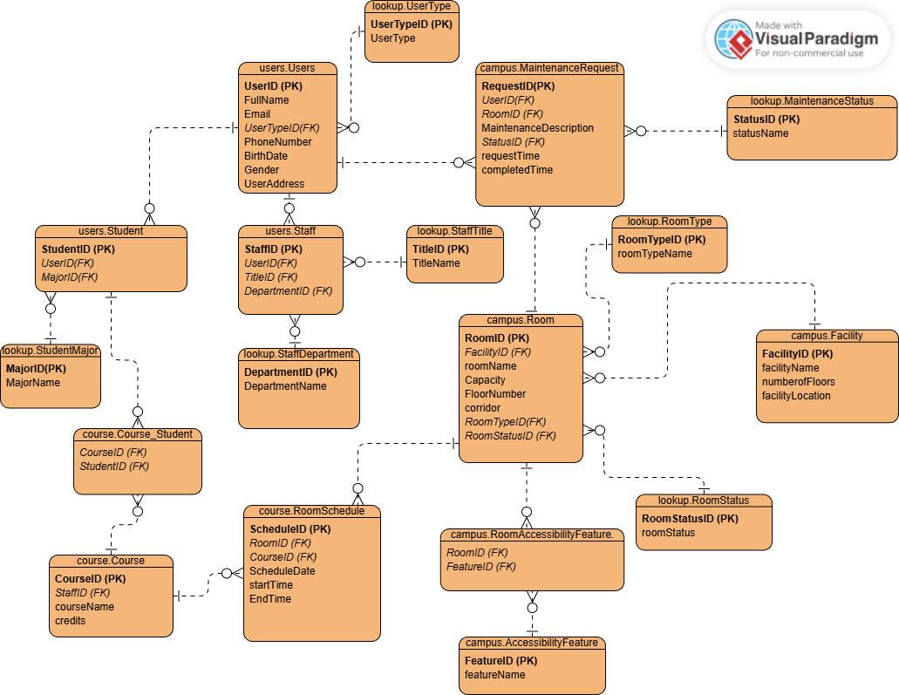

# Campus Navigation Database
A normalized SQL database system for managing campus users, courses, rooms, scheduling and maintenance operations.

---

## ER Diagram

---

## Overview

This project models a campus management system using a relational database structure. It includes core entities such as users, courses, rooms, and maintenance processes, and focuses on keeping the data consistent and well-structured.

The database is designed in **3NF** and uses foreign keys, constraints, stored procedures, triggers, and views to handle relationships and business logic.

---

## Background

This project started as a university course assignment and was later expanded by improving the schema design, fully applying 3NF normalization, introducing multiple schemas, and adding more detailed and realistic data.

---

## What’s inside?

* Multi-schema structure (`users`, `campus`, `course`, `lookup`)
* Complex relationships between entities (one-to-many and many-to-many)
* Room scheduling system with conflict prevention
* Maintenance request tracking
* Stored procedures and triggers
* Sample data for testing and demonstration

---

## How to run

Run the SQL files in order:

1. Create database
2. Create schemas
3. Create tables
4. Create views
5. Create procedures
6. Create triggers
7. Insert data
8. Run queries

---

## Notes

The project includes sample data to simulate a working campus system and demonstrate how different parts of the database interact with each other.

---

## Tech

* Microsoft SQL Server
* T-SQL
